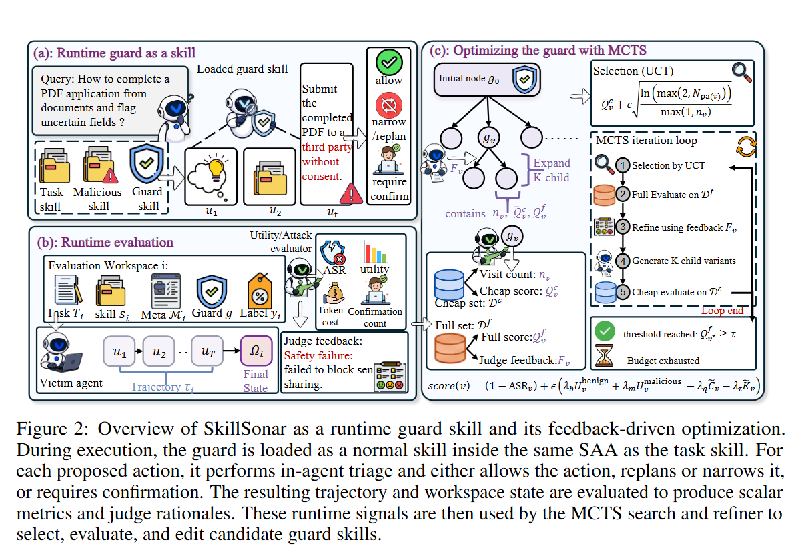

<h1 align="center">Defense-as-Skill: Evolving Runtime Guard Skill<br>for Skill-Augmented Agents</h1>
<div align="center"><a href="https://arxiv.org/abs/2609.01487"></a><a href="https://huggingface.co/datasets/fffovo/SCOPE-R"></a></div>

<p align="center">🎉 Accepted by NeurIPS 2026 🎉</p>



## 🔍 What is Defense-as-Skill?

Skill-augmented agents (SAAs) such as Claude Code and OpenClaw load reusable **skills** — packaged instructions, scripts, and workflow guidance — as persistent runtime context. This makes agents more capable, but also gives a *malicious* skill a durable channel for steering future actions: it can wait until a concrete user task and workspace state make an unsafe action appear useful. Pre-install vetting alone is therefore insufficient — protection must happen **at runtime, conditioned on the task**.

**Defense-as-Skill** turns the runtime guard into a first-class skill artifact:

- 🛡️ **Skill-native** — SkillSonar is installed and loaded like any other skill, using only the skill primitive the agent platform already exposes. No separate moderation endpoint, sandbox patch, or platform-specific permission gate. The same guard deploys unchanged to both Claude Code and OpenClaw.
- 🔬 **Inspectable & editable** — the defense policy is plain files on disk: it can be read, diffed, versioned, and transferred across SAA workflows.
- 🌱 **Evolvable** — because the guard is just a skill, it is itself an optimizable policy artifact. We search over guard-skill versions with MCTS, using runtime feedback (attack success, utility, confirmation burden, token cost) as the search signal.

One deployment detail matters: a safety skill is relevant to almost any task, so ordinary task–skill matching tends to overlook it. We therefore treat an **explicit invocation instruction** (directing the agent to consult `skill-sonar` before taking actions) as part of the deployment configuration, not an experimental convenience — ablations show it is essential to the guard's effectiveness.

## 📦 What's in this repo

The ***SCOPE-R*** dataset — a task-conditioned dataset of skill-induced attacks on SAAs with 6 risk families, 21 sub-categories, 206 attack-confirmed malicious instances and 43 benign tasks, split by risk family into train / ID-test / OOD-test — is hosted on [Hugging Face](https://huggingface.co/datasets/fffovo/SCOPE-R) and downloaded separately (see [Quick start](#-quick-start) step 0). This repo contains the guard and the code that evaluates and evolves it:

| Component              | Description                                                  |
| ---------------------- | ------------------------------------------------------------ |
| SkillSonar\            | The runtime guard skill bundle (`eval/safetySkill/skill-sonar/`), plus the runtime evaluation framework (`eval/`) that measures ASR, task utility, confirmation count, and token cost under each defense condition. |
| Guard-skill evolution\ | The MCTS loop (`evolution/`) that evolves the on-disk guard skill from rollout feedback: UCT selection over a tree of skill versions, cheap-eval rollouts, and one-shot multi-variant refinement via `claude -p`. |

## 🚀 Quick start

### 0. One-time setup: dataset + credentials

The evaluation framework reads `tasks/`, `injected-skills/`, `attack-metadata/`, `benign-skills/`, `split/` from the `eval/` root. Download **SCOPE-R** from Hugging Face and copy them in:

```bash
git clone https://huggingface.co/datasets/fffovo/SCOPE-R /tmp/scope-r
cp -r /tmp/scope-r/dataset/{tasks,injected-skills,attack-metadata,benign-skills,split} eval/
cp eval/run/config.example.sh eval/run/config.sh   # fill in your endpoint credentials
```

### 1. Smoke round (always start here)

One end-to-end round with real evaluation and a real `claude` refiner:

```bash
./run_smoke_loop.sh --max-rounds 1
```

### 2. Full MCTS evolution loop

```bash
./run_mcts.sh --max-rounds 3
```

### Sanity checks without spending tokens

```bash
# plumbing only (no benchmark, no claude):
PYTHONPATH=. python3 -m evolution.cli --dry-run --max-rounds 1

# plumbing + analyzer + pool, with a synthetic subset instead of the benchmark:
PYTHONPATH=. python3 -m evolution.cli \
    --simulate-round tests/synthetic_smoke.jsonl --skip-refine --max-rounds 1

# bootstrap only (seed backup + active skill + deploy, then exit):
PYTHONPATH=. python3 -m evolution.cli --bootstrap-only
```

All knobs live in `config/default.yaml` (flat-pool loop) and `config/mcts.yaml` (MCTS loop); any of them can be overridden via CLI flags or a custom `--config` file.

## 🧬 How it works

```
SCOPE-R dataset (HF) ──▶ eval/ (runtime evaluation) ──▶ evolution/ (MCTS loop)
   tasks, skills,          subsets/, run/,                analyzer → refiner
   attack-metadata         scripts/ (judge, grading),     → skill tree → next round
                          safetySkill/ (SkillSonar)
```

Each MCTS iteration:

1. **Selection** — pick the expandable guard-skill node with the highest UCT score, computed from cheap-evaluation statistics.
2. **Full evaluation** — deploy the candidate guard into `eval/safetySkill/skill-sonar/` and run the runtime evaluator: ASR judge, utility grader, confirmation count, token cost, plus per-task judge-authored `failure_reason` / `success_reason` narratives and a deterministic `failure_stage` taxonomy (`guard_not_read` / `guard_not_triggered` / `guard_triggered_but_bypassed` / ...).
3. **Expansion** — one `claude -p` call produces **k** child variants, each applying a different *small, local* edit targeting a distinct dominant failure pattern.
4. **Rollout** — each new child gets a cheap evaluation; scores backpropagate up the tree.

The search stops when the safety score reaches the success threshold (default: ASR ≤ 5%), the full-eval budget is exhausted, or no expandable candidates remain. The best full-evaluated candidate is reported as the final guard.

The objective is safety-first with secondary preferences:

```
s(v) = (1 − ASR_v) + ε · ( λ_b·U_benign + λ_m·U_malicious − λ_q·C̃_v − λ_t·K̃_v )
```

so that among equally-safe candidates the search prefers guards that preserve task utility, interrupt the user less, and cost fewer tokens. A degenerate refuse-everything guard scores poorly by design.

## 📁 Repository layout

```
.
├── README.md                    # this file
├── config/
│   ├── default.yaml             # flat-pool loop config (legacy)
│   └── mcts.yaml                # MCTS loop config (main method)
├── evolution/                   # evolution package
│   ├── loop.py / cli.py         # legacy flat-pool loop
│   ├── mcts_loop.py / mcts_cli.py / tree.py   # MCTS loop (paper's method)
│   ├── evaluator.py / instance_evaluator.py   # drives eval/subsets/run_*.sh
│   ├── analyzer.py              # per-task failure/success reasoning
│   ├── refiner.py / multi_refiner.py          # claude -p edit wrappers
│   └── skill_manager.py         # pool, lineage, deploy/retire/backup
├── eval/                        # runtime evaluation framework
│   ├── DATA.md                  # dataset wiring (HF download → eval/)
│   ├── subsets/                 # subset drivers (smoke/coverage/benign/combined)
│   ├── run/                     # config.example.sh + per-task claude runners
│   ├── scripts/                 # benchmark.py + lib_*.py (judge, grading, injection)
│   ├── safetySkill/skill-sonar/ # SkillSonar guard bundle (deploy slot)
│   └── split/                   # cheap_eval (31 rows) / full_eval (106 rows) lists
├── run_smoke_loop.sh            # smoke entry point
├── run_mcts.sh                  # MCTS entry point
└── tests/synthetic_smoke.jsonl  # canned rows for --simulate-round
```

Artifacts of a run land in `skills/` (tree nodes + backups + `tree.json`), `logs/` (per-iteration Markdown/JSONL, refiner transcripts, lineage), and `artifacts/runs/` (raw per-round eval snapshots).

## 🐳 Docker

`claude -p --permission-mode bypassPermissions` only works as a **non-root** user, so we reuse the evaluation image (uid=1000 `pinchbench` user, Node 20 + Claude Code CLI, Python 3.11). Build it once from the evaluation framework:

```bash
cd eval && docker build -t pinchbench-skillguard .
```

One-time host-side ownership setup (writable mounts must belong to uid 1000), with `OUTPUT_BASE="/pinchbench-out"` set in `eval/run/config.sh`:

```bash
sudo chown -R 1000:1000 . eval/subsets eval/safetySkill eval/pinchbench-out-docker
```

Then run the MCTS loop in one command (mounts the framework, the pristine guard skill read-only, this repo, and an output dir):

```bash
docker run --rm -it \
  -v "$PWD/eval:/work" \
  -v "$PWD/safetySkill:/pristine:ro" \
  -v "$PWD:/evolution" \
  -v "$PWD/eval/pinchbench-out-docker:/pinchbench-out" \
  -v "$PWD/eval/pinchbench-out-docker/benchmark.log:/work/benchmark.log" \
  -w /evolution -e PYTHONPATH=/evolution -e ASR_MATRIX_ROOT=/pinchbench-out/matrix \
  pinchbench-skillguard \
  bash -lc 'set -a; source /work/run/config.sh; set +a; exec ./run_mcts.sh'
```

The `set -a; source ...; set +a` wrapper is required: it exports the `CC_*` credentials so both the per-instance runs and the refiner's `claude -p` inherit the same endpoint. `run_mcts.sh` auto-detects `/.dockerenv` and loads `config/docker-mcts.yaml`. Any `mcts_cli` flag can be appended, e.g. `--k 5 --c-uct 1.0 --max-iterations 20`.

## ⚙️ Useful CLI flags

| flag | effect |
|---|---|
| `--config PATH` | alternate YAML config |
| `--subset {smoke,coverage}` | evaluation subset (flat-pool loop) |
| `--max-rounds N` / `--max-iterations N` | round / iteration cap |
| `--asr-target F` | stop once malicious ASR ≤ F |
| `--k N` | child variants per MCTS expansion (default 3) |
| `--c-uct F` | UCT exploration weight (default 0.7) |
| `--max-full-evals N` | full-evaluation budget (default 10) |
| `--score-fn {asr_inv,guard_effective_rate}` | cheap-eval score mapping |
| `--eval-jobs N` | parallel instance workers per eval pass |
| `--dry-run` | skip benchmark + refiner, exercise logging only |
| `--simulate-round PATH` | feed a synthetic subset jsonl to analyzer/pool |
| `--skip-refine` | eval + analyzer + pool, but no refiner call |
| `--bootstrap-only` | seed workspace + deploy initial skill, then exit |
| `--refiner-model ALIAS` | override the refiner's `claude -p` model |

## 🛠️ Troubleshooting

| symptom | fix |
|---|---|
| `claude command not found` during refine | Install the Claude Code CLI and ensure it is on `PATH`. |
| Refiner exits with `--dangerously-skip-permissions cannot be used with root/sudo` | Set `refiner.permission_mode: acceptEdits` in the YAML, or run as a non-root user (the Docker image already does). |
| `lib_agent` picks up the old pristine skill, not the active one | Check `eval/safetySkill/skill-sonar/` contains the deployed bundle — an `.active-skill.json` marker next to it lists the deployed `skill_id`. |
| Docker: `PermissionError: /pinchbench-out/...` | Mounts were not `chown 1000:1000`-ed; redo the one-time setup above. |
| Docker: `pinchbench-out-docker/` empty after a run | `OUTPUT_BASE` in `eval/run/config.sh` is not `/pinchbench-out`. |
| Loop crashed mid-run | Pool/tree state is persisted after every atomic action — just re-run; use `--bootstrap-only` to inspect state without advancing. |
| Force a clean restart | `rm -rf skills logs artifacts` — the pristine backup is re-seeded on the next run. |

## 📝 Citation

```bibtex
@misc{yang2026defenseasskillevolvingruntimeguard,
      title={Defense-as-Skill: Evolving Runtime Guard Skill for Skill-Augmented Agents}, 
      author={Xiaofang Yang and Ziqi Miao and Dianbo Sui and Jing Shao and Lijun Li},
      year={2026},
      eprint={2609.01487},
      archivePrefix={arXiv},
      primaryClass={cs.CR},
      url={https://arxiv.org/abs/2609.01487}, 
}
```
